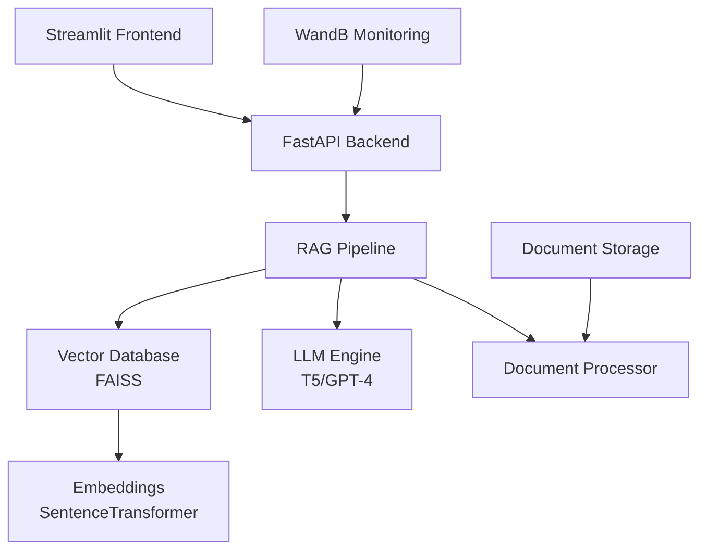

# 📚 Legal Document Analyzer

An advanced AI-powered system for analyzing legal documents using Retrieval-Augmented Generation (RAG) with state-of-the-art language models and vector search capabilities.

[](https://python.org)
[](https://fastapi.tiangolo.com)
[](https://streamlit.io)
[](LICENSE)

## 🌟 Features

### 📄 **Document Processing**
- **Multi-format Support**: PDF document processing with intelligent chunking
- **Smart Parsing**: Advanced text extraction with metadata preservation
- **Batch Processing**: Handle multiple documents simultaneously
- **Document Management**: Upload, view, and delete documents through the interface

### 🔍 **Intelligent Search & Analysis**
- **RAG Pipeline**: Retrieval-Augmented Generation for context-aware responses
- **Semantic Search**: FAISS vector database for similarity matching
- **Multi-model Support**: Google Flan-T5, OpenAI GPT-4, and Hugging Face models
- **Confidence Scoring**: Real-time confidence metrics for each response

### 🤖 **Advanced AI Integration**
- **T5 Conditional Generation**: Optimized for legal question-answering
- **Custom Prompting**: Legal-specific prompt engineering for detailed analysis
- **Model Flexibility**: Switch between local and API-based models
- **Performance Optimization**: Intelligent caching and batch processing

### 🌐 **Modern Web Interface**
- **Interactive Dashboard**: Real-time system monitoring and analytics
- **Multi-tab Interface**: Document management, querying, and system stats
- **Responsive Design**: Works on desktop and mobile devices
- **Real-time Updates**: Live status indicators and progress tracking

### 📊 **Monitoring & Analytics**
- **WandB Integration**: Comprehensive experiment tracking
- **Query Analytics**: Performance metrics and response quality
- **System Health**: Real-time API status and resource monitoring
- **Export Capabilities**: Download results and analytics data

## 🏗️ Architecture



## 🚀 Quick Start

### Prerequisites

- Python 3.8 or higher
- 8GB+ RAM recommended
- GPU optional (for local model inference)

### 1. Clone the Repository

```bash
git clone https://github.com/Aashan47/Legal-Document-Assistant.git
cd Legal-Document-Assistant
```

### 2. Set Up Virtual Environment

```bash
# Windows
python -m venv venv
venv\Scripts\activate

# macOS/Linux
python -m venv venv
source venv/bin/activate
```

### 3. Install Dependencies

```bash
pip install -r requirements.txt
```

### 4. Configure Environment

```bash
# Copy the example environment file
cp .env.example .env

# Edit .env with your API keys (optional for basic usage)
# Required for full features:
# - OPENAI_API_KEY (for GPT-4 support)
# - HUGGINGFACE_TOKEN (for model downloads)
# - WANDB_API_KEY (for monitoring)
```

### 5. Start the System

**Option A: Full ML System (Recommended)**
```bash
# Start the ML-powered API
python src/api/main_ml.py

# In a new terminal, start the UI
streamlit run src/ui/app_ml.py --server.port 8501
```

**Option B: Basic System**
```bash
# Start the basic API
python src/api/main_basic.py

# In a new terminal, start the UI
streamlit run src/ui/app_basic.py --server.port 8501
```

### 6. Access the Application

- **Web Interface**: http://localhost:8501
- **API Documentation**: http://localhost:8000/docs
- **Health Check**: http://localhost:8000/health

## 📖 Usage Guide

### Document Upload

1. Navigate to the "Document Management" tab
2. Click "Choose files" and select PDF documents
3. Upload and wait for processing confirmation
4. View processed documents in the document list

### Querying Documents

1. Go to the "Query Documents" tab
2. Enter your legal question in natural language
3. Click "Analyze" to get AI-powered insights
4. Review the response with confidence scores

### Example Queries

```
"What are the key terms and conditions in this contract?"
"What are the termination clauses?"
"Are there any liability limitations?"
"What are the payment terms and conditions?"
"What intellectual property rights are mentioned?"
```

### System Monitoring

1. Visit the "System Analytics" tab
2. Monitor real-time system performance
3. View query history and confidence trends
4. Export analytics data for further analysis

## ⚙️ Configuration

### LLM Models

The system supports multiple language models:

**Google Flan-T5 (Default)**
```python
HF_MODEL_NAME=google/flan-t5-base
HF_USE_INFERENCE_API=false  # Use local model
```

**OpenAI GPT-4**
```python
DEFAULT_LLM=openai
OPENAI_API_KEY=your_api_key_here
```

**Custom Hugging Face Models**
```python
HF_MODEL_NAME=microsoft/DialoGPT-medium
HF_USE_INFERENCE_API=true  # Use API
```

### Vector Database Settings

```python
CHUNK_SIZE=1000           # Document chunk size
CHUNK_OVERLAP=200         # Overlap between chunks
VECTOR_DB_PATH=./data/vector_db
```

### Performance Tuning

```python
LLM_TEMPERATURE=0.3       # Response creativity (0-1)
MAX_TOKENS=2048          # Maximum response length
CONFIDENCE_THRESHOLD=0.7  # Minimum confidence for responses
```

## 📁 Project Structure

```
Legal-Document-Assistant/
├── src/
│   ├── api/                    # FastAPI backend servers
│   │   ├── main_ml.py         # ML-powered API server
│   │   ├── main_basic.py      # Basic API server
│   │   └── main.py            # Legacy API server
│   ├── core/                   # Core system components
│   │   ├── rag.py             # RAG pipeline implementation
│   │   ├── vector_db.py       # FAISS vector database
│   │   └── config.py          # Configuration management
│   ├── data/                   # Data processing utilities
│   │   └── processor.py       # Document processing logic
│   ├── models/                 # LLM integrations
│   │   └── llm.py             # Multi-model LLM interface
│   ├── ui/                     # Streamlit frontend
│   │   ├── app_ml.py          # Enhanced ML interface
│   │   ├── app_basic.py       # Basic interface
│   │   └── app.py             # Legacy interface
│   └── utils/                  # Shared utilities
│       ├── logging.py         # Logging configuration
│       └── monitoring.py      # Performance monitoring
├── data/                       # Data storage
│   ├── uploads/               # Uploaded documents
│   ├── vector_db/             # Vector database files
│   └── sample_nda.txt         # Sample legal document
├── logs/                       # Application logs
├── tests/                      # Test suites
├── docker-compose.yml         # Docker configuration
├── Dockerfile                 # Container definition
├── requirements.txt           # Python dependencies
└── README.md                  # This file
```

## 🔧 API Reference

### Core Endpoints

**Health Check**
```bash
GET /health
```

**Upload Document**
```bash
POST /upload
Content-Type: multipart/form-data
```

**Query Documents**
```bash
POST /query
Content-Type: application/json
{
  "query": "What are the key terms in this contract?"
}
```

**List Documents**
```bash
GET /documents
```

**System Statistics**
```bash
GET /stats
```

**Clear All Documents**
```bash
DELETE /documents
```

### Response Format

```json
{
  "answer": "Detailed analysis of the legal document...",
  "confidence": 0.95,
  "sources": ["document_1_chunk_3", "document_1_chunk_7"],
  "query_id": "unique_query_identifier",
  "processing_time": 2.34
}
```

## 🐳 Docker Deployment

### Using Docker Compose

```bash
# Build and start all services
docker-compose up -d

# View logs
docker-compose logs -f

# Stop services
docker-compose down
```

### Manual Docker Build

```bash
# Build the image
docker build -t legal-document-analyzer .

# Run the container
docker run -p 8000:8000 -p 8501:8501 \
  -v $(pwd)/data:/app/data \
  -e OPENAI_API_KEY=your_key_here \
  legal-document-analyzer
```

## 🧪 Testing

### Run Unit Tests

```bash
# Run all tests
python -m pytest tests/

# Run with coverage
python -m pytest tests/ --cov=src/

# Run specific test file
python -m pytest tests/test_api.py -v
```

### API Testing

```bash
# Test API endpoints
python tests/test_api.py

# Manual API testing
curl -X GET http://localhost:8000/health
```

## 📊 Performance & Monitoring

### WandB Integration

The system automatically logs:
- Query performance metrics
- Model response times
- Confidence score distributions
- System resource usage

### Performance Optimization

**Memory Management**
- Automatic model caching
- Efficient vector storage
- Smart chunk processing

**Speed Optimization**
- Parallel document processing
- Cached embeddings
- Optimized model inference

## 🤝 Contributing

### Development Setup

1. Fork the repository
2. Create a feature branch (`git checkout -b feature/amazing-feature`)
3. Install development dependencies (`pip install -r requirements.txt`)
4. Make your changes
5. Add tests for new functionality
6. Run the test suite (`python -m pytest`)
7. Commit your changes (`git commit -m 'Add amazing feature'`)
8. Push to the branch (`git push origin feature/amazing-feature`)
9. Open a Pull Request

### Code Style

- Follow PEP 8 guidelines
- Use type hints where applicable
- Add docstrings for all functions and classes
- Write comprehensive tests

### Reporting Issues

When reporting issues, please include:
- Operating system and Python version
- Complete error traceback
- Steps to reproduce the issue
- Expected vs actual behavior

## 📝 License

This project is licensed under the MIT License. See the [LICENSE](LICENSE) file for details.

## 🙏 Acknowledgments

- **Hugging Face** for providing the T5 model and transformers library
- **OpenAI** for GPT-4 API integration
- **Facebook Research** for FAISS vector database
- **Streamlit** for the interactive web interface
- **FastAPI** for the high-performance API framework
- **WandB** for experiment tracking and monitoring

## 📞 Support

- **Documentation**: Check the [docs](./docs/) folder for detailed guides
- **Issues**: Report bugs on [GitHub Issues](https://github.com/Aashan47/Legal-Document-Assistant/issues)
- **Discussions**: Join conversations in [GitHub Discussions](https://github.com/Aashan47/Legal-Document-Assistant/discussions)

## 🔮 Roadmap

- [ ] **Multi-language Support**: Support for non-English legal documents
- [ ] **Advanced Analytics**: More detailed document analysis and insights
- [ ] **Collaborative Features**: Multi-user support and document sharing
- [ ] **Mobile App**: Native mobile application
- [ ] **Advanced Security**: Enhanced encryption and access controls
- [ ] **Integration APIs**: Connect with legal practice management systems

---

<div align="center">

**Built with ❤️ for the legal community**

[⭐ Star this repo](https://github.com/Aashan47/Legal-Document-Assistant) | [🐛 Report Bug](https://github.com/Aashan47/Legal-Document-Assistant/issues) | [✨ Request Feature](https://github.com/Aashan47/Legal-Document-Assistant/issues)

</div>
